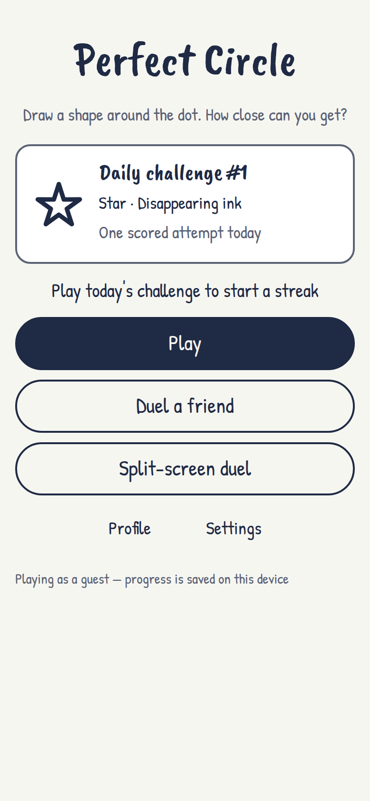
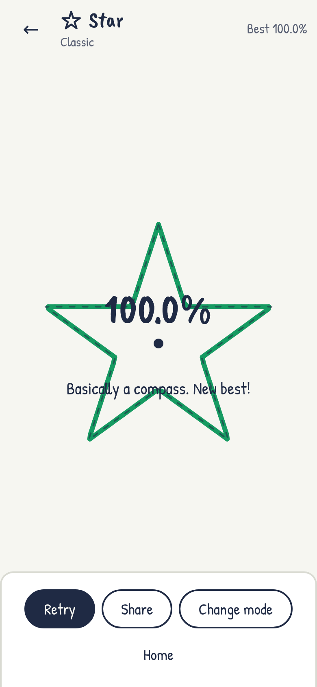
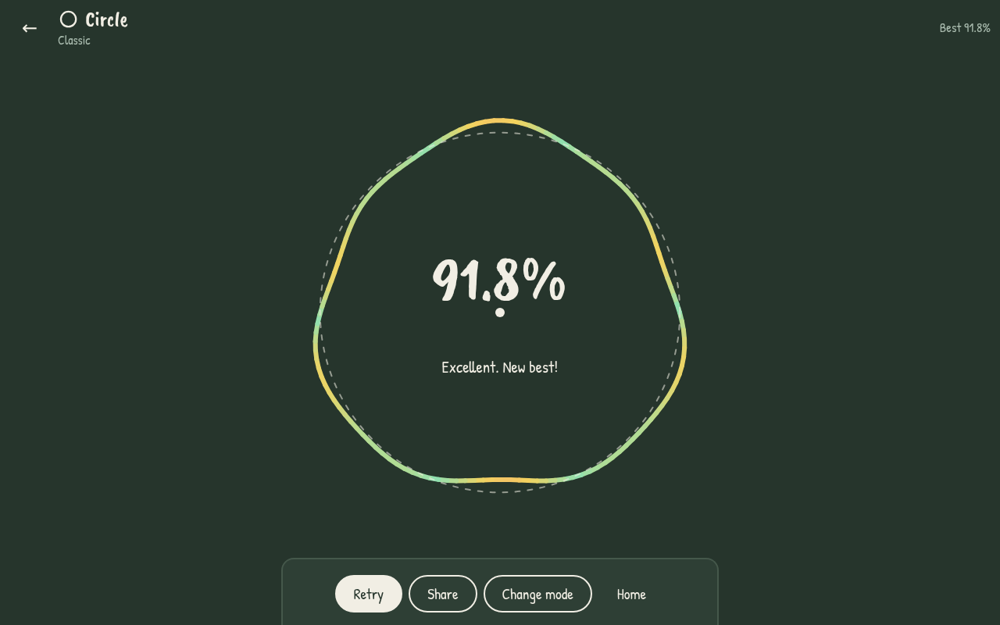

# Perfect Circle

**Draw a shape freehand around a dot and get an accuracy score from 0 to 100%.**
Circles, squares, triangles and stars; four game modes; 1v1 duels; a daily challenge; streaks and badges.
It runs on your own computer as a small server, and phones and laptops on the same Wi-Fi join in the browser.
No cloud, no accounts elsewhere, no cost.


| Home (phone) | Result (phone) | Result (laptop, dark mode) |
|---|---|---|
|  |  |  |

---

## Contents
- [Features](#features)
- [Quick start](#quick-start)
- [Play on phones and other laptops](#play-on-phones-and-other-laptops)
- [Scripts](#scripts)
- [How scoring works](#how-scoring-works)
- [Project structure](#project-structure)
- [Testing](#testing)
- [Running it permanently](#running-it-permanently)
- [Project documents](#project-documents)
- [Tech stack](#tech-stack)
- [Contributing](#contributing) · [Security](#security) · [Licence](#licence)

## Features

| Area | What you get |
|---|---|
| **Shapes** | Circle, square, triangle and 5-point star. The ideal shape is fitted to your drawing, including its rotation. |
| **Modes** | Classic · Time limit (5, 3 or 2 s) · Disappearing ink (fades after 0.4 s) · Moving dot (30 px/s figure-eight) · Non-dominant hand tag |
| **Feedback** | Live score while drawing, the line coloured green → red, the dashed ideal shape on top, and a clear reason when an attempt is rejected |
| **Duels** | Online 1v1 on two devices with a 4-character room code or QR code, synced 3-2-1 countdown, best of 3. Also split-screen on one tablet, or turn by turn with a mouse |
| **Daily challenge** | The same shape and mode for everyone each UTC day, one scored attempt, Wordle-style share text and a top-100 leaderboard |
| **Progression** | Daily streak and best streak, 12 badges, and a history graph (daily best + 7-day average) filterable by shape, mode, off-hand and 7/30/90 days |
| **Accounts** | Optional: nickname + 4-digit PIN (stored hashed) to share progress between phone and laptop. Guests can play without one |
| **App** | Installable PWA; solo play works offline; light (whiteboard) and dark (chalkboard) themes; works with mouse, touch and stylus; keyboard-friendly menus |

## Quick start

**You need:** [Node.js](https://nodejs.org) 22.12 or newer (24 LTS recommended) and [Git](https://git-scm.com).

```bash
git clone <your-repo-url> perfect-circle
cd perfect-circle
npm install
npm test          # → Tests 48 passed (48)
npm run build     # → ✓ built
npm start         # → Perfect Circle is running.
```

Open **http://localhost:3000**.

> **npm 11.19+:** if `npm install` warns that `better-sqlite3`, `esbuild` or `fsevents` have install scripts that aren't allowed, run
> `npm install-scripts approve better-sqlite3 esbuild fsevents` and then `npm rebuild better-sqlite3 esbuild fsevents`.
> This repository's `package.json` already lists them under `allowScripts`.
>
> **macOS:** if building `better-sqlite3` fails, run `xcode-select --install` first.
> **Windows:** use PowerShell. If it says running scripts is disabled, run `Set-ExecutionPolicy -Scope CurrentUser RemoteSigned` once.

## Play on phones and other laptops

1. `npm start` prints the address to use, for example `Phones on Wi-Fi: http://192.168.1.5:3000`.
2. Open it on any device connected to the **same Wi-Fi**.
3. Allow Node.js through the computer's firewall, on private networks only.
   - **macOS:** click **Allow** when asked, or go to System Settings → Network → Firewall → Options.
   - **Windows:** tick **Private networks** in the Windows Security pop-up.
4. Give the computer a fixed address (a DHCP reservation in the router) so the link doesn't change.

## Scripts

| Command | What it does |
|---|---|
| `npm start` | Starts the server on port 3000 (serves `dist/` + API + duels). Uses `data/perfect-circle.db` |
| `npm run start:test` | Same, but with `data/test.db` and the test-only date override, for business testing |
| `npm run build` | Type-checks and builds the game into `dist/` |
| `npm run dev` | Development mode with instant reload on port 5173 (run `npm start` too, for the API) |
| `npm test` | Runs the 48 unit tests (Vitest + Supertest) |
| `npm run coverage` | Unit tests plus the coverage report |
| `npm run e2e` | Playwright browser tests of the business scenarios (run `npx playwright install` once first) |

## How scoring works

1. **Capture:** every pointer position is recorded with a time; movements under 2 px are ignored as jitter.
2. **Validate:** the attempt is rejected if a point comes within 45 px of the dot, the stroke goes back more than 0.45 rad, it covers less than 93% of a turn, it takes longer than the time limit, or it has fewer than 10 points.
3. **Resample:** the stroke is turned into 128 evenly spaced points, so fast and slow drawers are treated the same.
4. **Moving dot only:** each point is measured against where the dot was at that moment.
5. **Fit the ideal shape:**
   - **Circle:** R is the average distance from the dot.
   - **Polygons:** the best size and rotation are searched in 1° steps.
   - **Error:** d is the average distance of the points from the ideal outline.
6. **Score:**

   ```
   score = max(0, 100 × (1 − 2.5 × d / R)) × corner coverage
   ```
   Corner coverage (squares, triangles, stars) is the share of corners you reached within 12% of R.

The server runs the **same scoring code** (`src/scoring`) again for daily-challenge and duel scores; a score sent by a browser is never trusted.

## Project structure

```
perfect-circle/
├─ src/                    browser code
│  ├─ input/               capture.ts (pointer events), resample.ts (128 points)
│  ├─ scoring/             circle.ts, polygon.ts, templates.ts, validate.ts, index.ts  ← shared with the server
│  ├─ modes/               timed.ts, ink.ts, moving.ts
│  ├─ render/              draw.ts (canvas), colours.ts, sound.ts
│  ├─ daily/               seed.ts (challenge of the day), share.ts (share text)
│  ├─ progression/         streak.ts, badges.ts, history.ts
│  ├─ duel/                room.ts, match.ts (best of 3), split-screen.ts
│  ├─ data/                indexeddb.ts (on-device storage), sync.ts, api.ts
│  ├─ screens/             home, setup, play, daily, duel, split, profile, settings, board.ts, ui.ts
│  └─ state.ts             settings, login, saving results
├─ server/
│  ├─ index.ts             starts HTTP (or HTTPS if certs/ exists) on port 3000
│  ├─ app.ts               Express: /api routes + the built game
│  ├─ routes/              login, attempts, daily, leaderboard
│  ├─ duel.ts              Socket.IO rooms, synced countdown, server-side scoring
│  ├─ db.ts · schema.sql   SQLite (better-sqlite3)
├─ tests/
│  ├─ unit/                UT-01 … UT-48
│  ├─ e2e/                 Playwright business scenarios (BT-xx)
│  └─ helpers/strokes.ts   generates perfect and noisy test shapes
├─ docs/                   project documents, test report, prototype, screenshots
├─ public/                 icons and favicon
└─ data/                   the SQLite database (created on first run, never committed)
```

## Testing

- **Unit tests** (`npm test`): the 48 cases UT-01 to UT-48 from the Unit Test Document. Line coverage is 94.9% overall (scoring 99.3%).
- **End-to-end** (`npm run e2e`): the Business Testing scenarios that a browser can check by itself, run on laptop Chrome, an Android phone size and iPhone Safari. The test server starts automatically with a throw-away database.
- **CI:** [`.github/workflows/test.yml`](.github/workflows/test.yml) runs both on every push and pull request.

See the [v0.1 build and test report](docs/build-and-test-report.md) for results and open items.

## Running it permanently

```bash
npm i -g pm2
pm2 start npm --name perfect-circle -- start
pm2 save && pm2 startup     # then run the one line it prints
```

- **Update after code changes:** `npm run build && pm2 restart perfect-circle`
- **Back up:** stop the server and copy `data/perfect-circle.db` somewhere safe.
- **Install as an app on phones:** needs local HTTPS. Create `certs/cert.pem` and `certs/key.pem` with [mkcert](https://github.com/FiloSottile/mkcert):

  ```bash
  mkcert -key-file certs/key.pem -cert-file certs/cert.pem localhost <your-ip>
  ```
  Then restart, and trust the mkcert root certificate on each phone. The server switches to HTTPS by itself.

## Project documents

Prepared by **Manya Bansal** (product owner):

| # | Document | |
|---|---|---|
| 1 | Requirement Document | [PDF](docs/01-Requirement-Document.pdf) |
| 2 | Functional Design | [PDF](docs/02-Functional-Design.pdf) |
| 3 | Technical Design Document | [PDF](docs/03-Technical-Design-Document.pdf) |
| 4 | Unit Test Document | [PDF](docs/04-Unit-Test-Document.pdf) |
| 5 | Business Testing Documentation | [PDF](docs/05-Business-Testing-Documentation.pdf) |
| – | v0.1 Build and Test Report | [Markdown](docs/build-and-test-report.md) |
| – | Original single-file prototype | [HTML](docs/prototype/perfect-circle.html) |

Out of scope for v0: public hosting, a domain, app-store builds, payments or ads, in-game chat, friend lists.

## Tech stack

TypeScript · Vite · HTML canvas · Pointer Events · Chart.js · IndexedDB (idb) · vite-plugin-pwa · Node.js + Express 4 ·
Socket.IO 4 · SQLite (better-sqlite3) · bcryptjs · express-rate-limit · Vitest + Supertest · Playwright

## Contributing

See [CONTRIBUTING.md](CONTRIBUTING.md). Please follow the [Code of Conduct](CODE_OF_CONDUCT.md).
Report bugs with the **Bug report** issue template (test ID, steps, expected vs actual result, severity).

## Security

The server is meant for a **private local network only**. See [SECURITY.md](SECURITY.md) for how player data is protected and how to report a problem.

## Licence

[MIT](LICENSE) © 2026 Manya Bansal
